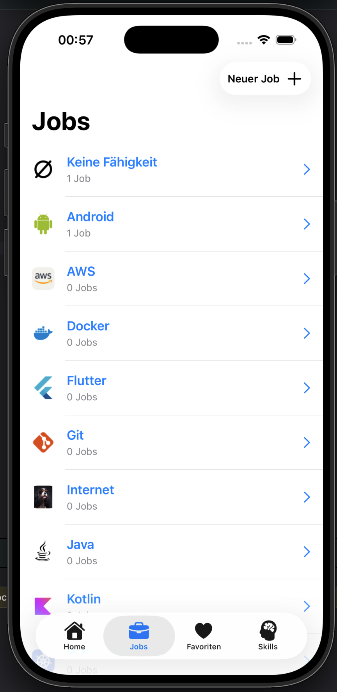
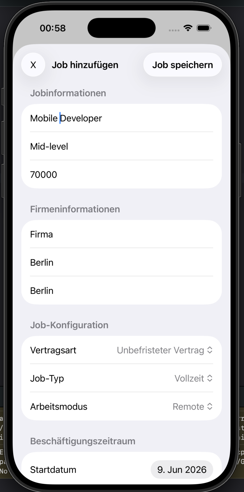
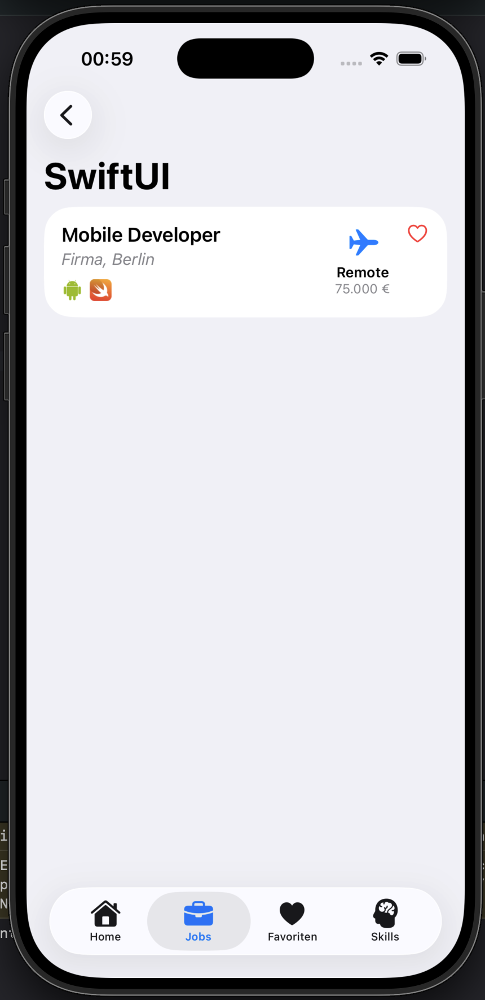
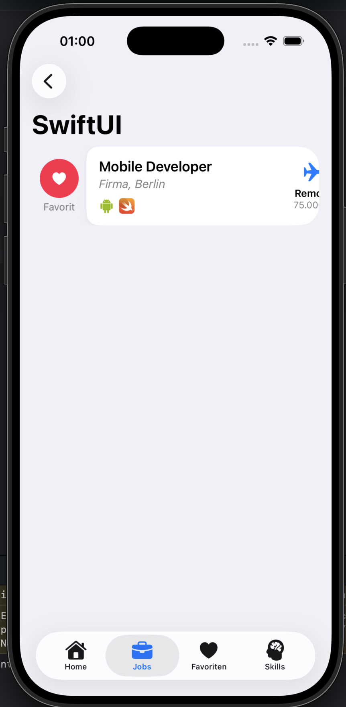
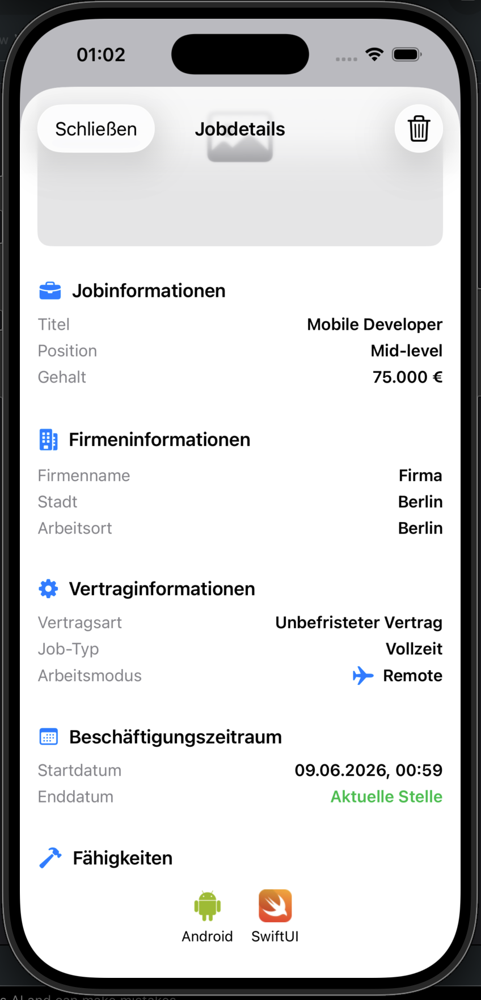
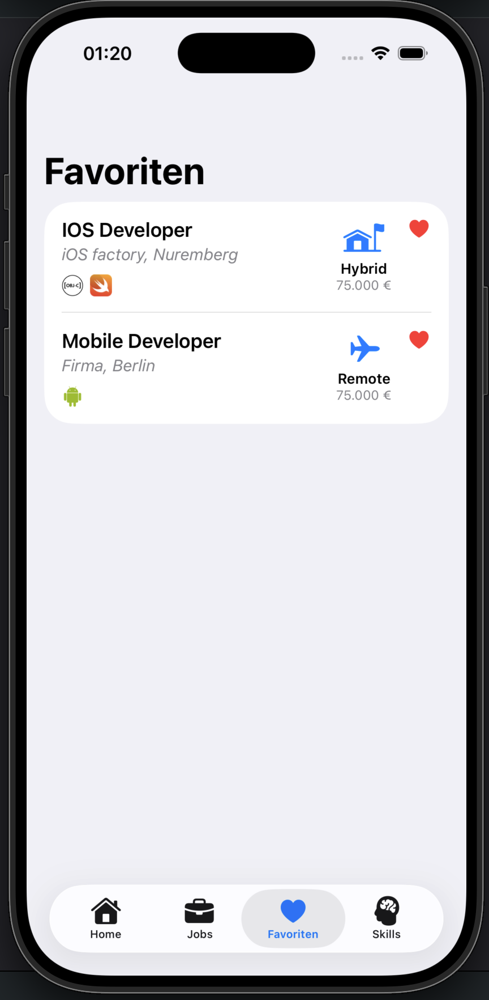
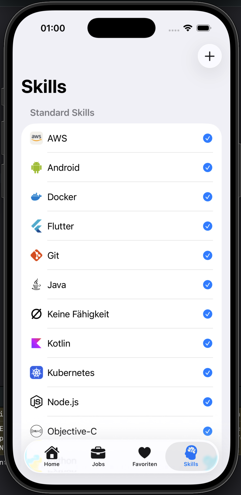
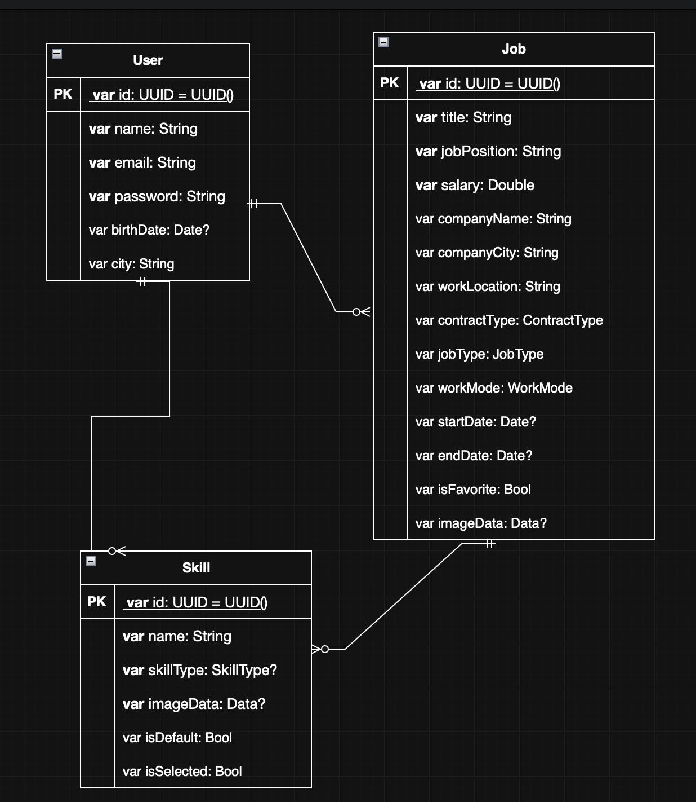

# 💼 TraumJobs App – Week 4 Project

An iOS SwiftUI application that helps users manage dream jobs, professional skills, and career preferences while practicing persistent data storage with SwiftData and UserDefaults.

---

  
  &nbsp;
  
  &nbsp;
  
  &nbsp;
  
  &nbsp;
  
    &nbsp;
  
      &nbsp;
  

## 🧠 Project Idea

The goal of this project is to build a job management application where users can organize dream jobs, track required skills, manage favorites, and store personal preferences permanently.

The app focuses on learning persistent data management using SwiftData and UserDefaults while applying SwiftUI best practices.

Users can:

* Create and manage jobs
* Save professional skills
* Assign skills to jobs
* Mark jobs as favorites
* Store personal settings
* Upload job-related images
* View detailed job information

The project emphasizes database relationships, data persistence, and user customization.

---

## 🛠️ Tech Stack

* Swift
* SwiftUI
* SwiftData
* UserDefaults
* Xcode
* NavigationStack
* TabView
* State Management (`@State`, `@Binding`)
* MVVM-inspired structure (Models / Views)

---

## 🧱 Project Structure

### Models

* Job.swift
* Skill.swift
* User.swift

### Views

* LoginView.swift
* SignUpView
* HomeView.swift
* JobView.swift
* JobAddView.swift
* JobDetailSheetView
* FavoriteView.swift
* SkillView.swift
* SettingsView
* EditUserSheet

---

## ⚙️ Features

### 💼 Job Management

* Create jobs dynamically
* Store job information persistently
* Add salary information
* Upload job-related images
* Manage favorite jobs

Each job contains:

* Job Title
* Position
* Salary Information
* Company Name
* Company Location
* Workplace Location
* Contract Type
* Employment Type
* Work Mode (Remote, Hybrid, On-site)
* Start and End Dates
* Favorite Status
* Assigned Skills
* Optional Image

---

## 📋 JobsView

* Displays all saved jobs
* Alphabetically sorted job list
* Swipe to favorite jobs
* Swipe to delete jobs
* Open detailed job information

### ➕ JobAddView

* Create new jobs using Forms
* Add Job information
* Select and save an image
* Assign skills to jobs
* Save data with SwiftData

### 📄 JobDetailView

* Dedicated detail screen for each job
* Displays all stored information
* Shows uploaded job image
* Lists assigned skills
* Delete job directly from detail view

---

## ⭐ Favorite Jobs

### JobsFavoriteView

* Displays only favorite jobs
* Automatically updates when favorites change
* Alphabetically sorted
* Access to job details

Features:

* Favorite-only filtering
* Dynamic updates
* Consistent user experience

---

## 🛠️ Skills Management

### SkillsView

* Create new skills
* Store skills permanently
* Display all available skills
* Reuse skills across multiple jobs

---

## ⚙️ Settings Screen

### SettingsView

Store personal preferences using UserDefaults.

Supported settings:

#### 👤 User Information

* Username
* Email Address
* Birth Date
* City

---

## 🗄️ Data Persistence

### SwiftData

Used for:

* Jobs
* Skills
* Relationships between Jobs and Skills
* Favorite status
* Job images

  

### UserDefaults

Used for:

* Username
* Email
* Birth Date
* City
* Notification settings (mocked)
* App preferences (mocked)

---

## 🔗 Relationships

The application implements a many-to-many relationship between Jobs and Skills.

### Job

A job can have multiple skills.

### Skill

A skill can belong to multiple jobs.

Example:

Job: iOS Developer

Required Skills:

* Swift
* SwiftUI
* Git
* Teamwork

---

## 👤 User Session Management

The application includes a custom session management system built with `@Observable` and `@MainActor`.

Features:

* User authentication with email and password
* Guest login support
* Persistent login state using UserDefaults
* Automatic session restoration when the app launches
* User-specific job management
* Secure logout functionality

The `SessionManager` handles user authentication, session persistence, and retrieval of the currently logged-in user through SwiftData.

---

## 🎨 Modern UI

* Tab-based navigation
* Forms and Sheets
* NavigationStack
* Swipe Actions
* Persistent storage
* Dynamic Lists
* SF Symbols integration
* Responsive layouts

---

## 📚 Concepts Practiced

* SwiftData
* UserDefaults
* @Model
* @Query
* @Relationship
* @Observable
* @MainActor
* Data Persistence
* Session Management
* User Authentication
* NavigationStack
* TabView
* Forms
* Sheets
* Lists
* Swipe Actions
* State Management
* Image Picker
* Model Relationships
* One-to-Many Relationships
* Many-to-Many Relationships
* CRUD Operations
* Data Filtering & Sorting
* SwiftUI Architecture

---

## 🚀 Learning Goals

This project was created to practice:

* Persistent data storage with SwiftData
* Saving user preferences with UserDefaults
* Building database relationships
* Managing user-generated content
* Creating multi-screen SwiftUI applications
* Working with forms and user input
* Implementing CRUD operations
* Structuring larger SwiftUI projects

---

## 🌟 Additional Features

Features implemented beyond the basic requirements:

* Favorite jobs management
* Image support for jobs
* Skill assignment system
* Separate favorites screen
* User settings persistence
* Dynamic filtering and sorting
* Enhanced UI design
* User authentication system
* Guest account support
* Persistent login sessions
* Automatic session restoration
* User-specific job collections

---

## 👨‍💻 Author

Developed as part of the Syntax Institute iOS Development Program using SwiftUI, SwiftData, and UserDefaults.
